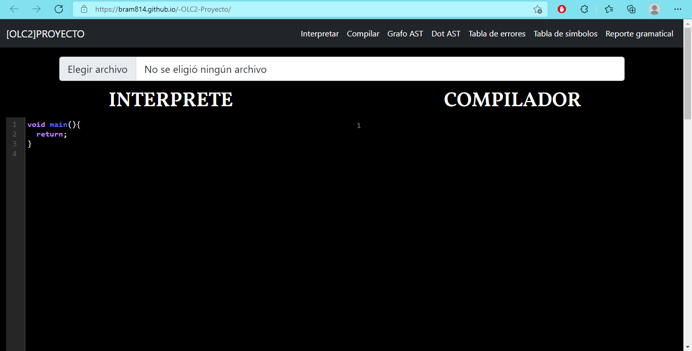
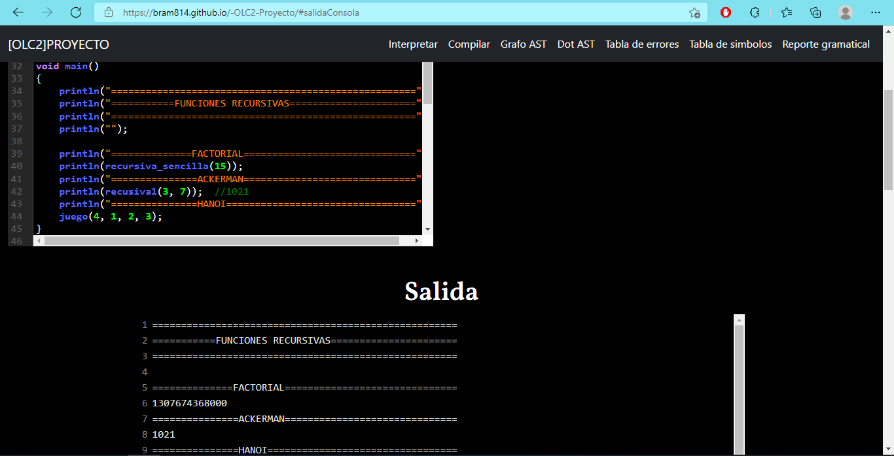
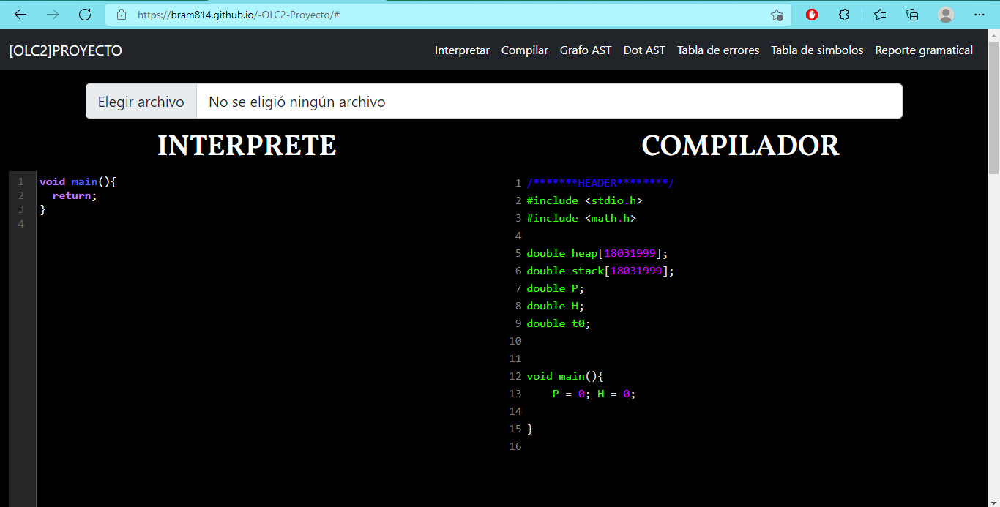
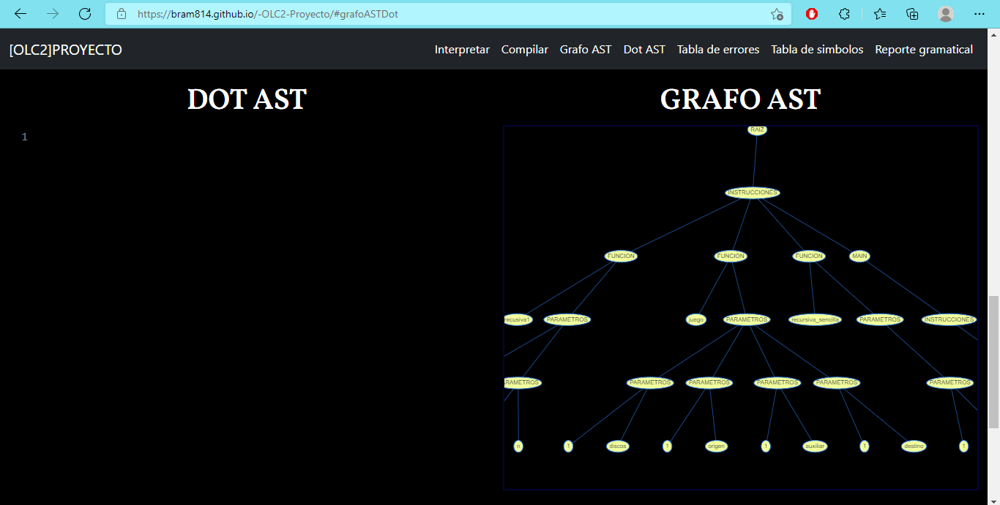
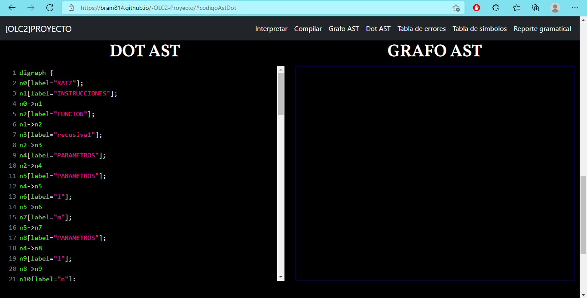
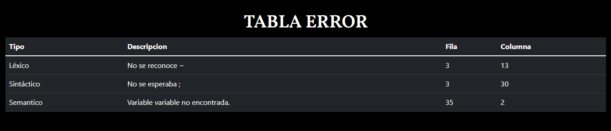
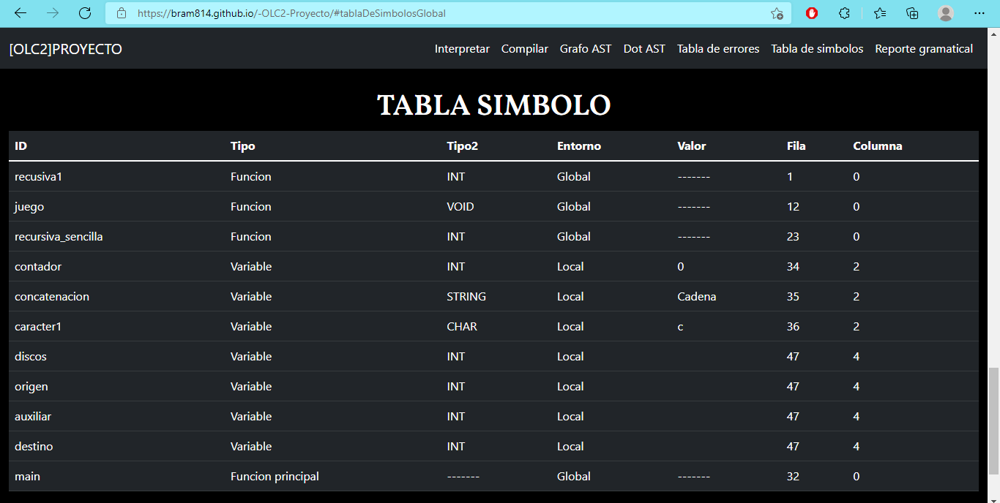
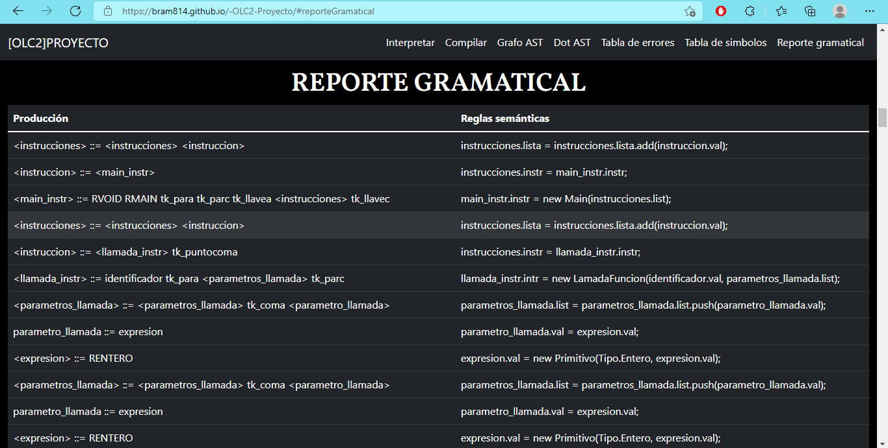

# Proyecto 1 Compiladores 2

## Tabla de contenido
1. [Manual de usuario](#manualUsuario)
2. [Manual técnico](#manualTecnico)

## Manual de usuario <a name="manualUsuario"></a>

## Índice
1. [Requisitos para ejecutar el proyecto](#requisitoEjecutar)
2. [¿Cómo ejecutar el programa?](#requisitoEjecutar)
3. [Partes del editor](#partesEditor)
4. [Sintaxis del lenguaje aceptado](#sintaxisLenguaje)
    1. [Comentarios](#comentarios)
    2. [Tipos de datos](#tiposDatos)
    3. [Operaciones aritméticas](#operacionesAri)
    4. [Operaciones Relacionales](#operacionesRela)
    5. [Operaciones lógicas](#operacionesLogi)
    6. [Operaciones con cadenas](#operacionesCade)
    7. [Funciones nativas](#funcNat)
    8. [Impresión de datos](#funcPrint)
    9. [Declaración y asignación](#declaSigna)
    10. [Sentencias de control](#sentenciaControl)
    11. [Sentencias cíclicas](#sentenciaCiclica)
5. [Código de 3 direcciones](#c3d)


### Requisitos para ejecutar el proyecto <a name="requisitoEjecutar"></a>
-   Tener instalado algún navegador web (Google Chrome, Microsoft Edge, Firefox).
-   Una computadora con al menos 4 GB de memoria RAM.

### ¿Cómo ejecutar el programa? <a name="comoEjecutar"></a>
Para poder usar el interprete disponemos de dos opciones:
-   Clonar el repositorio del proyecto con la terminal, utilizando el siguiente comando y abrir el archivo index.html
```git
git clone https://github.com/bram814/-OLC2-Proyecto
```

-   También podemos utilizar el interprete accediendo al siguiente enlace https://bram814.github.io/-OLC2-Proyecto donde encontraremos una demo del proyecto.

### Partes del editor <a name="partesEditor"></a>
Encontraremos distintos apartados en el editor, cada parte destinada a un uso especifico. 



### **Elegir archivo** 
Con esta opción podremos cargar archivos de texto para poder interpretarlos o compilarlos posteriormente, el contenido del archivo se mostrara en el editor con apartado INTERPRETE.

### **Interpretar** <a name="interpretar"></a>
Con esta opción interpretaremos el código escrito o cargado que aparezca dentro del editor de texto con apartado INTERPRETE. Mostrando el resultado en la salida de consola en el apartado 'Salida'.



### **Compilar**
Esta opción se utiliza para generar el código de tres direcciones del código escrito dentro del apartado 'interprete', mostrando el resultado en el apartado 'Compilador'.



### **Grafo AST**
Esta opción genera el grafo del árbol de análisis sintáctico (AST) que se produce a partir del contenido en el editor de texto. Mostrando de forma detallada la estructura sintáctica del código fuente ingresado.



### **DOT AST** 
Genera el código en formato DOT del árbol de sintaxis abstracta, para poder ser visualizada en alguna pagina online o con alguna otra herramienta.



### **Tabla de errores**
Muestra los errores léxicos, sintácticos y semánticos producidos al [_interpretar_](#interpretar) el código ingresado; en una tabla de HTML. Mostrando el tipo del error, una breve descripción, la línea y columna donde se origina.



### **Tabla de símbolos**
Muestra la tabla de símbolos generada a partir del código ingresado en el editor, mostrando el identificador, tipo, valor, ámbito, línea y columna de los símbolos encontrados en la ejecución del programa.



### **Reporte gramatical**
Muestra la gramática utilizada para interpretar el código introducido en el editor, detallando las producciones, símbolos y reglas semánticas necesarias para realizarlo.



##Sintaxis del lenguaje aceptado <a name="sintaxisLenguaje"></a>

El lenguaje reconocido por el analizador está basado en java, por lo que la sintaxis y palabras reservadas son bastante similares. 
### Comentarios <a name="comentarios"></a>
Los comentarios son porciones de código que no se interpretan, únicamente sirven para documentar el código. 
Se aceptan dos tipos de comentarios:
-   **Comentarios simples:** Únicamente abarcan una lunes y se realizan con el operador //
    ```java
    //Comentario de una sola línea
    ```
-   **Comentarios multilínea:** Abarcan múltiples líneas, se encierran entre /* comentario */
    ```java
    /*Comentario
    de múltiples
    líneas*/
    ```
### **Tipos de dato permitidos** <a name="tiposDatos"></a>
-   **int:** Son números de tipo entero positivos y negativos (312, -431).
-   **double:** Son números decimales positivos y negativos (3.14159, -54.67).
-   **boolean:** Únicamente puede tomar el valor de **true** o **false**.
-   **char:** Son caracteres definidos entre comillas ('f','\n','a').
-   **String:** Son cadenas de texto encerradas entre comillas "Cadena de texto".
-   **Nulo:** Indica que no existe un valor.

### Operaciones aritméticas posibles <a name="operacionesAri"></a>
-   **Suma:** Es posible sumar dos expresiones numéricas utilizando el símbolo **+**.

-   **Resta:** Es posible restar dos expresiones numéricas utilizando el operador **-**.

-   **Multiplicación:** Es posible multiplicar dos expresiones numéricas utilizando el operador *.

-   **División:** Es posible dividir dos expresiones numéricas utilizando el operador **/**.

-   **Módulo:** Es posible encontrar el residuo de una división con el operador **%**.

-   **sqrt(número):** Calcula la raíz cuadrada de un número.

-   **sin(número):** Calcula el seno del número solicitado.

-   **con(número):** Calcula el coseno del número solicitado.

-   **tan(número):** Calcula la tangente del número solicitado.

### Operaciones relacionales (Comparación) <a name="operacionesRela"></a>

| OPERADOR | DESCRIPCION | EJEMPLO|
|----------|-------------|--------|
|Igual igual (==)|Devuelve true si la comparación es verdadera y false si la comparación es falsa.| 3 == 3 //true|
|Diferente (!=)|Devuelve true si los operadores no son iguales.| 3 != "cadena" //true|
|Mayor que (>)|Devuelve true si el operando izquierdo es mayor que el operando derecho.| 3 > 2 //true|
|Menor que (<) |Devuelve true si el operando izquierdo es menor que el operando derecho.| 5< 19 //true|
|Mayor igual (>=)|Devuelve true si el operando izquierdo es mayor o igual que el operando derecho.| 4 >= 3 //true|
|Menor igual (<=)|Devuelve true si el operando izquierdo es menor o igual que el operando derecho.| 5 <= 5 //true|

### Operaciones Lógicas <a name="operacionesLogi"></a>

| OPERADOR | DESCRIPCION | EJEMPLO|
|----------|-------------|--------|
|AND (&&)|Devuelve true si ambos operandos son true, de lo contrario, devuelve false.| true && true //true|
|OR (`||`)|Devuelve true si alguno de los operandos es true, si ambos son falsos, devuelve false.| true `||` false //true|
|NOT (!)|Devuelve false si el operador es true y devuelve true si el operador es false| !true // false|

### Operaciones con cadenas <a name="operacionesCad"></a>

-   **Concatenación:** Es posible concatenar dos cadenas de texto utilizando el operador &.
```java
"Cadena1" & "Cadena2" = "Cadena1Cadena2"
```

-   **Repetición:** Para hacer que una cadena se repita "n" veces se debe usar el operador ^, utilizando el siguiente formato:
    ```java
    "cadena" ^ numero de repeticiones
    "Cadena" ^ 3 = "CadenaCadenaCadena"
    ```

### Funciones nativas <a name="funcNat"></a>
-   **Acceso a una posición:** Para acceder a una posición de una cadena, es posible utilizar la función nativa string.caracterOfPosition(posición).
    ```java
    String cadena = "Mi cadena de prueba";
    cadena.caracterOfPosition(3);  // c
    ```
-   **Acceso a una porción:** Para acceder a la porción de una cadena, es posible utilizar la función nativa string.subString(inicio, final).
    ```java
    String cadena = "Mi cadena de prueba";
    cadena.subString(0,5);  // Mi cad
    ```
-   **Cadena en  mayúsculas:** Para convertir una cadena de texto en mayúsculas, es posible utilizar la función nativa string.toUppercase().
    ```java
    String cadena = "Mi cadena de prueba";
    cadena.toUpperCase);  // MI CADENA DE PRUEBA
    ```
-   **Cadena en  minúsculas:** Para convertir una cadena de texto en minúsculas, es posible utilizar la función nativa string.toLowercase().
    ```java
    String cadena = "Mi Cadena De Prueba";
    cadena.toUpperCase);  // mi cadena de prueba
    ```
### Impresión de datos <a name="funcPrint"></a>
Para imprimir los datos en consola es posible utilizar dos funciones:
-   **Println(expresión);** Esta función se utiliza para imprimir datos en la consola con un salto de línea al final de la expresión.
-   **Print(expresión);** Esta función se utiliza para imprimir datos en la consola sin un salto de línea al final de la expresión.

### Declaración y asignación de variables <a name="declaSigna"></a>
Para declarar variables se debe de seguir la siguiente sintaxis:

```java
TIPO identificador = expresión;
o
Tipo id1, id2, id3...idn;
```
Por ejemplo:
```java
int variableNumerica = 12;
String variableCadena = "Soy una cadena de texto";
char letraC = 'c';
double id1, id2, id3... idn;
```

Para asignarle valor a una variable, la expresión a asignarle debe ser del mismo tipo que la variable, de lo contrario se mostrará error.
```java
int numero1, numero2, numero3;
numero1 = 12+28;
numero2 = 100;
numero3 = "200";  //Esto mostrara un error al interpretarse
```

### Declaración de arreglos
Los arreglos son conjuntos de datos del mismo tipo que se almacenan dentro de una misma estructura, donde se puede acceder a cada posición por medio de su numero de índice.
La declaración de los arreglos sigue la siguiente sintaxis:
```java
TIPO identificador = [lista_de_expresiones];
```
Si los datos de la lista de expresiones no coincide con la del tipo de la variable se mostrará un error.
```java
int arreglo1 = [1,2,3,4,5];
char lista_caracteres = ['a','s','','d','\n']
String mascotas = ["perro", "garo", "loro", 2]; // Error: Tipos incompatibles
```
### Acceso a los arreglos
Para acceder a alguna posición del arreglo se debe de realizar indicando el identificador del arreglo seguido el numero de índice al que deseamos acceder encerrado entre corchetes.
```java
int[] lista = [1,2,3,4,5];
lista[1]; //Accediendo a la posición 1 que almacena el numero 2
```
### Arreglos por referencia y copia de arreglos
Al asignarle el identificador de un arreglo a otro arreglo, estos se estarían igualando por referencia lo que provocaría que los cambios realizados en cualquiera de los arreglos modificaría al otro.
Para evitar esto es posible crear una copia de un arreglo con el operador **#**.
```java
int[] arreglo1 = [1,2,3,4,5,6];
int[] arreglo2 = arreglo1; //Arreglos por referencia
int[] copia = #arreglo1;   //Se crea una copia del arreglo.
```

### Declaración de structs
Es un tipo de dato compuesto de otros tipos de datos o incluso arreglos que se definen mediante la siguiente sintaxis:
```java
struct identificador {
    LISTA_ATRIBUTOS
}
```
Ejemplo:
```java
struct persona{
    int edad,
    String nombre,
    double altura
}
```
Se pueden declarar variables de tipo struct, siguiente la siguiente sintaxis:
```java
NOMBRE_STRUCT identificador = NOMBRE_STRUCT(lista_valores);
```
Ejemplo:
```java
persona p1 = persona(12, "Eduardo", 1.6);
```
También podemos acceder y asignar valores a atributos específicos de cada struct con el operador **.**.
```java
println(p1.nombre) //Imprime Eduardo
p1.edad = 22;      //La edad cambia de 12 a 22
```

### Declaración de funciones
Una función es un bloque de código que ejecuta una tarea determinada y puede o no retornar un valor.
Para declarar una función deberemos seguir la siguiente sintaxis:   
```java
TIPO nombre_funcion(lista_parametros){
    lista_instrucciones
}
```
Ejemplo:
```java
void mostrarSaludo(String nombre){
    println("Hola ", nombre);
}

int suma(int numA, numB){
    return numA + numB;
}

double retornarPi(){
    return 3.141592654;
}
```

Si el tipo de la función es **void**, significa que no devolverá algún valor de lo contrario; devolverá algún dato del tipo de la función.

Los parámetros como arreglos y structs se pasan por referencia, lo que indica que los cambios que sufran dentro de las funciones también afectaran a los arreglos originales.

### Llamada a funciones
Para ejecutar una función se debe de llamar en desde cualquier parte del código de la siguiente forma:
```java
suma(12,10);
retornarPi();
```
Si la función devuelve algún valor, se podrá asignar a una variable al momento de ser llamada, por ejemplo:
```java
int resultado = suma(10,12);  // resultado = 22
double pi = retornarPi();     // pi = 3.141592654
```
### Otras funciones nativas
|Función|Descripción|Ejemplo|
|-------|-----------|-------|
|tipo.Parse(string)|Toma una cadena y se convierte al tipo de dato indicado si es posible.|int.parse("100"); //retorna 100 (int)|
|toInt(decimal)|Convierte un numero decimal a entero sin redondearlo| toInt(4.788); //retorna 4|
|toDouble(entero)| Convierte un entero a un decimal.|toDouble(32); // retorna 32.0|
|String(expresión)|Convierte a String cualquier tipo de dato recibido, exceptuando null| String(23.52); //retorna "23.53"|
|typeof(expresión)|Devuelve el tipo de dato del argumento recibido.|typeof(23) //retorna int|

### Sentencia if <a name="sentenciaControl"></a>
La sentencia **if** se utiliza para verificar alguna condición antes ejecutar el bloque de  código en su interior, luego de la sentencia if pueden o no seguir una o varias sentencias **else if** y al final puede o no existir la sentencia **else**.
Obteniendo como sintaxis lo siguiente:
```java
if(CONDICION){
    LISTA_INSTRUCCIONES
}

if(CONDICION){
    LISTA_INSTRUCCIONES
}else if(INSTRUCCION){
    LISTA_INSTRUCCIONES
}...(lista de sentencias else if)
else{ //Posible else
    LISTA_INSTRUCCIONES
}
```
Por ejemplo:
```java
if(3 < 5){
    println("El número es menor a 5");
}else{
    println("El número es mayor o igual a 5");
}

if(var1 == var2){
    println("Los datos son iguales.");
}else if(var1 > var2){
    println("var1 es mayor a var2");
}else if(var1 < var2){
    println("var1 es menor a var2");
}else{
    println("No se cumple con ninguna condición.");
}
```

### Sentencia switch
La sentencia switch se utiliza para tomar una decisión a partir de una sentencia dada.
```java
switch(expresión) {
    case x:
        LISTA_INTRUCCIONES
        break;
    case y:
        LISTA_INTRUCCIONES
        break;
    case
    ... //Lista de case 
    default: //Posible default
        LISTA_INTRUCCIONES
}
```

Por ejemplo:
```java
switch (day){
    case 1:
        dayString = "Lunes";
        break;
    case 2:
        dayString = "Martes";
        break;
    case 3:
        dayString = "Miércoles";
        break;
    case 4:  
        dayString = "Jueves";
        break;
    case 5:  
        dayString = "Viernes";
        break;
    case 6:  
        dayString = "Sábado";
        break;
    case 7: 
        dayString = "Domingo";
        break;
    default: 
        dayString = "Dia inválido";
        break;
}
```

### Sentencias cíclicas <a name="sentenciaCiclica"></a>
Permiten repetir un determinado número de veces un grupo de instrucciones, o para recorrer un conjunto de objetos o estructuras compuestas por más de un elemento.

### For
Disponemos de dos tipos de for, uno para ejecutar un ciclo determinado numero de veces y otro especializado en recorrer arreglos o cadenas de texto.
Se definen en la siguiente sintaxis:
```java
for(declaración || asignación; condición; instrucción){
    LISTA_INSTRUCCIONES
}

for variable in arreglo || cadena {
    LISTA_INSTRUCCIONES
}
```

Ejemplos:
```java
for(int i = 0; i < 10; i++){
    print(i);
}
//Resultado -> 0123456789
for item in [1,2,3,4,5]{
    print(item);
}
//Resultado -> 12345
```

### While
Ejecuta el bloque de instrucciones que contiene siempre y cuando al evaluar la condición se obtenga como resultado **true**.
Se define por la siguiente sintaxis.
```java
while(condición || expresión){
    LISTA_INSTRUCCIONES
}
```
Por ejemplo:
```java
int i = 0;
while(i < 6){
    print(i);
    i++;
}
//Resultado-> 012345
```

### Do While
Ejecuta siempre el bloque de instrucciones cuando se accede por primera vez y luego se sigue ejecutando en un ciclo siempre y cuando la condición sea verdadera.
```java
do{
    LISTA_INSTRUCCIONES
}while(condición || expresión);
```
Ejemplo:
```java
int i = 10;
do{
    println("Dentro de do while");
}while(i < 5);
// Resultado -> Dentro de do while
```

### Generación de código de 3 direcciones <a name="c3d"></a>
El compilador transforma la entrada en otro lenguaje de la misma estructura que C y solamente se aceptan tipos de dato float y enteros.
Para generar el código de tres direcciones se dispone de los siguiente:

### Comentarios
Los comentarios son porciones de código que no se interpretan, únicamente sirven para documentar el código. 
Se aceptan dos tipos de comentarios:
-   **Comentarios simples:** Únicamente abarcan una lunes y se realizan con el operador //
    ```java
    //Comentario de una sola línea
    ```
-   **Comentarios multilínea:** Abarcan múltiples líneas, se encierran entre /* comentario */
    ```java
    /*Comentario
    de múltiples
    líneas*/
    ```

### Operadores aritméticos
Se aceptar los siguientes operadores aritméticos, cada uno solo contará con dos parámetros.
|Operación|Símbolo|
|---------|-------|
|Suma|+|
|Resta|-|
|Multiplicación|*|
|Módulo|%|

### Operadores condicionales
Se aceptar los siguientes operadores condicionales, cada uno solo contará con dos parámetros.
|Operación|Símbolo|
|---------|-------|
|Menor que|<|
|Mayor que|>|
|Menor igual|<=|
|Mayor igual|>=|
|Diferente|!=|
|Igual igual|==|

 ### Imprimir datos con print y println
 También se puede traducir impresiones en consola utilizando la funcion print(expresión) y println(expresión). Permitiendo generar la traduccion a código C.
 
 
# Manual técnico <a name="manualTecnico"></a>

### Índice
1. [Requerimientos](#requ)
2. [Instalar requerimientos](#instalarReq)
2. [Especificaciones del sistema](#especif)
3. [Clases que conforman la estructura del proyecto](#estrucProy)
4. [Clase abstracta Instruction](#clsInstr)
4. [Expresiones](#exprTec)
4. [Instrucciones](#instrTec)

### Requerimientos <a name="requ"></a>
-   Node.js y npm
-   Contar con la herramienta jison 0.4.18
-   Librería vis 4.21.0
-   Algún editor de código JS de preferencia Visual Studio Code

### Instalando requerimientos <a name="instalarReq"></a>

### Instalar Node.js
-   Para instalar Node.js en Windows se debe visitar su [página oficial](https://nodejs.org/es/) donde se podrá descargar el instalador. Al descargarlo se debe ejecutar y continuar con el proceso de instalación hasta finalizar, Node.js nos es útil ya que necesitamos el gestor de paquetes **npm**.
-   Si estamos en Ubuntu, únicamente se deberá ejecutar el siguiente comando en la terminal:
```
$ sudo apt install nodejs
```

### Instalar jison
Para instalar jison se necesita el administrador de paquetes **npm** que se instala junto con Node.js. Para instalarlo se debe de ejecutar el siguiente comando en el CMD (en Windows) o en la terminal(en Ubuntu):
```
npm install jison -g
```

### Instalar vis.js
Esta librería se utiliza para generar el grafo del árbol AST y para esto se debe descargar desde su [página oficial](https://almende.github.io/vis/#download_install), descomprimir y colocar el contenido de la carpeta en la carpeta de nuestro proyecto.

### Especificaciones del sistema <a name="especif"></a>
El sistema fue desarrollado utilizando el patrón interprete, que consiste en crear una clase abstracta con métodos que son implementados en todas las clases donde se herede. Facilitando la ejecución de cada una de las funcionalidades que el intérprete debe realizar.

### Clases que conforman la estructura del proyecto <a name="estrucProy"></a>
-   **Exception.js**
Esta clase se utiliza para almacenar los errores encontrados al interpretar o traducir el programa, recibiendo como parámetro el tipo de error, una descripción, la fila y columna donde sucedió.

-   **Simbolo.js**
Esta clase se utiliza para crear los objetos de tipo símbolo que son necesarios al momento de crear o modificar una variable. Recibe como parámetros el tipo de la variable, un identificador, la fila y columna de la declaración y el valor que tiene.

-   **Tipo.js**
Esta es una clase de tipo enum, donde se listan los tipos de datos que se pueden manejar, los operadores aritméticos, lógicos y relacionales que son permitidos.

-   **Clase Arbol.js**
Esta clase se utiliza para almacenar y retornar gran cantidad de información, como la lista de instrucciones que se desean interpretar, las funciones creadas, los errores encontrados al momento de interpretar, la tabla de símbolos global... A continuación, se listan todos los atributos almacenados en la clase:
    -   Funciones
    -   Excepciones
    -   Salida de consola
    -   Tabla de símbolos global
    -   Cadena del archivo DOT para generar el AST

-   **Generator.js**
Esta clase se encarga de manejar los temporales, etiquetas, el heap y stack que se encargan de realizar la traducción de código de alto nivel a código de 3 direcciones. También contiene la estructura para generar la salida en consola de c3d. También contiene métodos que controlan la traducción del print() y println() así como las operaciones aritméticas, lógicas y relacionales.

### Clase abstracta Instruction <a name="clsInstr"></a>
Esta clase abstracta se creó con el objetivo de servir como plantilla para todas las funcionalidades del interprete, implementando los siguientes métodos abstractos:
-   **interpretar(tree, table):** Este método se utiliza para interpretar todas las funcionalidades del sistema, recibiendo como parámetro una tabla se símbolo que se utiliza para almacenar y modificar nuevas variables o funciones que se crean en la ejecución del programa. También se recibe como parámetro un árbol que se encarga de almacenar las tablas de símbolo, las instrucciones que se solicitan y también las excepciones que van surgiendo a lo largo de la ejecución del programa.

-   **getNodo()** Este método se utiliza para crear los nodos necesarios para graficar el ast de todo el código recibido.
-   **compilar()** Este método se utiliza para traducir el código de alto nivel a código de tres direcciones.

### Expresiones <a name="exprTec"></a>
Las expresiones realizan operaciones entre datos para que las demás funcionalidades obtengan resultados de forma correcta, los tipos de operaciones que se realizan son, aritméticas, lógicas, relacionales, obtención de identificadores y datos primitivos.
A continuación, se listan las expresiones con las que se cuenta:
-   **Aritmetica.js** Se encarga de recibir dos expresiones y un operador, se interpreta cada expresión para obtener su valor y se verifica que tipo de operador se tiene. Las operaciones dependiendo del operador que se tenga son la suma, resta, multiplicación, división, módulo y el negativo de un número. EL tipo de dato que se retorna debe de ser numérico (int o double);

-   **Logica.js** Recibe dos expresiones y un operador, se interpreta cada expresión para obtener su valor y dependiendo del operador que se tenga las operaciones que se pueden realizar son las siguientes: AND (&&), OR (||), NOT(!). Para el operador NOT solamente se debe de recibir una expresión. El tipo de dato que se retorna debe de ser booleano (true o false).

-   **Relacional.js**Recibe dos expresiones y un operador, se interpreta cada expresión para obtener su valor y dependiendo del operador que se tenga las operaciones que se pueden realizar son las siguientes: Igual igual (==), diferente(!=), mayor que (>), menor que (<), menor igual(<=), mayor igual(>=).  El tipo de dato que se retorna debe de ser booleano (true o false).

-   **Primitivo.js** Se encarga de crear un objeto donde se unifican los parámetros recibidos como el tipo, valor, línea y columna. Permitiendo facilitar la evaluación posterior con la comparación de tipos y no de valores. Cuando se interpreta desde una clase exterior devuelve el valor del dato primitivo almacenado.

-   **Identificador.js** Se encarga de almacenar los identificadores encontrados al interpretar el programa, almacenando el tipo e identificador de este, permitiendo crear símbolos donde se relacionan identificadores y valores.

### Instrucciones <a name="instrTec"></a>
Todas las instrucciones implementan la clase abstracta Instrucion.js, donde se realizan todos los procesos para que funcione la instrucción.

-   **AccesoArreglo.js** Se encarga de recibir el identificador de algún arreglo y una lista de posiciones (si el arreglo es de más de una dimensión) y también puede o no venir un nuevo valor para esa posición. 
Primero se verifica que el identificador exista en la tabla de símbolos y que sea de tipo array (si no se cumple con alguna de estas dos condiciones se retorna un error), luego de haber encontrado el identificador se crea una lista de posiciones con las expresiones de las posiciones recibidas.
Por último, se evalúa si se cuenta con un nuevo valor, si no se cuenta con un nuevo valor, el arreglo del identificador encontrado se manda a un método buscar posición junto con la lista de posiciones y se retorna el valor encontrado. Si se cuenta con un nuevo valor, también se manda al método buscar posición junto con la lista de posiciones para buscar la posición deseada y se le asigna el nuevo valor y se retorna null.

-   **Asignacio.js** La clase asignación recibe como parámetro el identificador de una variable y una expresión que será el nuevo valor de la variable.
Primero se busca el identificador en la tabla de símbolos para determinar si existe (al no existir se retorna un error), al encontrarse la variable se verifican que los tipos de datos coincida (identificador y expresión) también se acepta la asignación de datos de tipo int a datos de tipo double, por último, se crea un nuevo símbolo con los datos con los que se cuentan y se actualiza la tabla de símbolos.

-   **Break.js** Retorna la instancia de la clase.

-   **Case.js** Verifica que la condición recibida sea verdadera o falsa, para esto se interpreta la condición y si el valor retornado es algún error, se retorna; de lo contrario se retorna el valor obtenido.

-   **Continue.js** Retorna la instancia de la clase.

-   **DeclaracionArrayRC.js** En esta clase se declara un arreglo por referencia o creando una copia del arreglo, recibe como para metro el tipo de dato, un identificador, el identificador del arreglo de donde se obtendrán los valores y una variable booleana donde que indica si el arreglo se copiara o se declarara por referencia. 
Primero se obtiene el símbolo del identificador secundario retornando error si no es del tipo nuevo o si no se encuentra en la tabla de símbolos. Si se quiere copiar entonces se crea una copia de los valores del arreglo con JSON.parse(JSON.stringifi(arreglo)), luego se crea un nuevo símbolo con los datos obtenidos y se agrega a la tabla de símbolos.
Si lo que se desea es declarar el arreglo por referencia se obtiene el arreglo del símbolo obtenido y se asigna al nuevo símbolo a crear para crear la referencia.

-   **Declaracion.js** En esta clase se declara una nueva variable y se almacena en la tabla de símbolos, para declarar una nueva variable se recibe como parámetros el tipo, el identificador o lista de identificadores y un posible valor, si el valor es null se asigna un valor por defecto dependiendo del tipo de la variable.

-   **DeclaracionArrau.js** En esta clase se declara un nuevo arreglo, para esto se recibe como parámetros el tipo del arreglo, un identificador y la lista de expresiones que contendrá el arreglo.
Se comienza verificando que el tipo de la variable sea igual al tipo de los datos de la lista de expresiones, luego se verifica cada dato de las expresiones para detectar algún arreglo anidado, por último, se crea un nuevo símbolo con los datos con los que se cuenta y se guarda en la tabla de símbolos. Si se detecta algún error durante estos procesos se crea una nueva excepción y se retorna.

-   **Decremento.js** Esta clase recibe como parámetro un identificador y en el método heredado de la clase abstracta Instruction.js se busca el identificador en la tabla se símbolos, al no encontrarse se retorna una nueva excepción, de lo contrario se verifica que los tipos sean numéricos y se procede restarle 1 al valor del símbolo encontrado, por último, se retorna el nuevo valor.

-   **Do_While.js** Esta clase recibe como parámetro una condición y una lista de expresiones, en el método heredado de la clase abstracta se crea un ciclo while que se ejecuta hasta infinitamente, dentro del while se interpreta la condición recibida para verificar si se sigue con el ciclo si la condición es verdadera se interpreta cada una de las instrucciones de la lista de instrucciones, al finalizar se vuelve a comparar la condición para decidir si el ciclo se repite o no. 
Las únicas formas de detener el ciclo es que la condición de false o que se encuentre una instrucción con instancia de break.

-   **For.js** La clase for recibe como parámetro un identificador, una condición, una actualización y una lista de instrucciones. Al comenzar a ejecutar el método interpretar() se crea una nueva tabla de símbolos que recibe como parámetro la tabla anterior, luego se verifica que la condición sea de tipo booleana y que el resultado sea true para seguir con la ejecución de las instrucciones utilizando como parámetro la nueva tabla de símbolos simulando un nuevo ámbito para cada iteración. 
Si el tipo de la condición no es booleano si no cadena, sabremos que lo que tenemos es un array o un string por lo que se procede a recorrer cada posición y de igual forma por cada posición recorrida se interpreta cada una las instrucciones que se tienen verificando que no sean instancia de break, return o continue, de lo contrario se estaría saliendo del ciclo o se estaría continuando con la siguiente iteración.
Si la condición es de tipo array, se recorre cada una de las posiciones ejecutando cada una de las instrucciones dentro de la lista de instrucciones.  

-   **Funcion.js** Esta clase recibe como parámetro el tipo de la función, el identificador, y la lista de parámetros. Dentro del método interpretar se recorre cada una de las instrucciones recibidas y se interpretan, verificando que no sean instrucciones break o continue retornando error si lo fueran y con la instrucción return se retornaría algún valor que sea del tipo de la instrucción.

-   **If.js** La función if recibe como parámetros una condición, una lista de instrucciones para el if, una lista de instrucciones para la else if y una lista de instrucciones para la instrucción else.
En el método interpretar se verifica que la condición sea verdadera, de serla se interpreta cada una de las instrucciones del if. Luego se verifica que las instrucciones del else if sean diferentes a null y de serlo se interpreta cada una de las instrucciones. Por último, se verifica que las instrucciones del else no sean null y se interpretan cada una de las instrucciones.

-   **Main.js** En la clase main se recibe como parámetro una lista de instrucciones. En el método interpretar se recorre cada una de esas instrucciones, retornando error si se encuentra una instrucción break o continue porque estarían fuera de un ciclo.

-   **Print.js** Esta clase recibe como parámetro una lista de expresiones, en el método interpretar se recorre cada una de las expresiones y se concatena el valor que tenga para actualizar la salida de la consola al finalizar de recorrer las expresiones.

-   **Println.js** Esta clase recibe como parámetro una lista de expresiones, en el método interpretar se recorre cada una de las expresiones y se concatena el valor que tenga para actualizar la salida de la consola al finalizar de recorrer las expresiones, agregando un salto de línea al final.

-   **Return.js** Recibe como parámetro una expresión, en el método interpretar se verifica que la expresión no sea null, se interpreta y se retorna una instancia de la clase almacenando el tipo y valor obtenido.

-   **Switch.js** En la clase switch se recibe como parámetro, una condición, una lista de instrucciones de case, y una lista de instrucciones de un posible default. En el método interpretar se valida que la lista de instrucciones case y default no sean nulas para luego recorrer cada una de las listas e interpretar las instrucciones que contienen si la condición es igual al resultado obtenido. Esto se realiza para cada una de las listas de instrucciones recibidas guardando los errores que se encuentren para seguir con la ejecución de las demás instrucciones y también ejecutando código especial al encontrar instrucciones como return, continue y break.

-   **Ternario.js** La clase ternario recibe como parámetro una condición, una instrucción para el resultado verdadero y una instrucción para el resultado falso. En el método interpretar se evalúa la condición y si es verdadera se interpreta la instrucción verdadera y se retorna; si es falsa se interpreta la instrucción para el resultado falso y se retorna si no es una instancia de excepción.

-   **While.js** Esta clase recibe como parámetro una condición y una lista de instrucciones, en el método interpretar se crea un ciclo infinito y se obtiene el valor de la condición, si es verdadera se crea una nueva tabla de símbolos para crear un nuevo ámbito.
Cuando la condición es verdadera se interpreta cada una de las instrucciones que contiene la lista de instrucciones dentro del while. Si la instrucción es instancia de continue se ejecuta break para dejar de ejecutar las instrucciones actuales y se pasa al siguiente ciclo.

